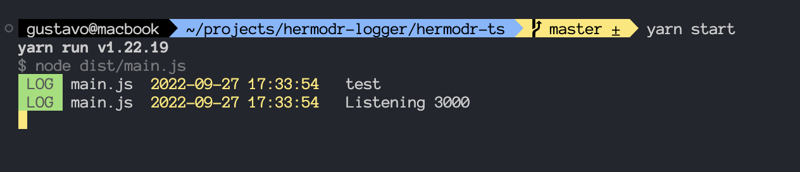

# Hermodr Logger

Hermodr, the messenger of the Norse gods, came to help you make your records easier to understand and a little more colorful.

I'had 

The Hermodr log was created to log on to the console and to a database at the same time.

Two ways were developed to create your logs, backend and frontend, respectively called hermodr-cmd and hermodr-browser.

### Hermordr-cmd
It logs into the colored CMD and also transmits it to a mongoBD database, it has an API to retrieve data from the database.

### Dependencies and technologies used

#### Technologies
- nodeJS
- MongoDB

#### Dependencies
- express: ^4.17.1 (**for sample only**)
- mongoose:^5.9.7

## How to use

download the hermodr.js file and import it into your files.

``
import hermodr from 'YOUR_PATH';
``

to log into the console and the database use log types like the one below.

``
hermodr.info (MARKER, CONTENT);
``

log types:
- log
- debug
- error
- warn

to log only to the database

``
hermodr.db (MARKER, CONTENT);
``

### How to use the sample
I did 2 examples, one with express and the other with restify, feel free to use whatever you think is best!

run to install dependencies 

``
npm install
``

to run the sample
``
node .\src\index.js
``
**Remember** to change the connection string in the index.js file (line 7)

## Images

